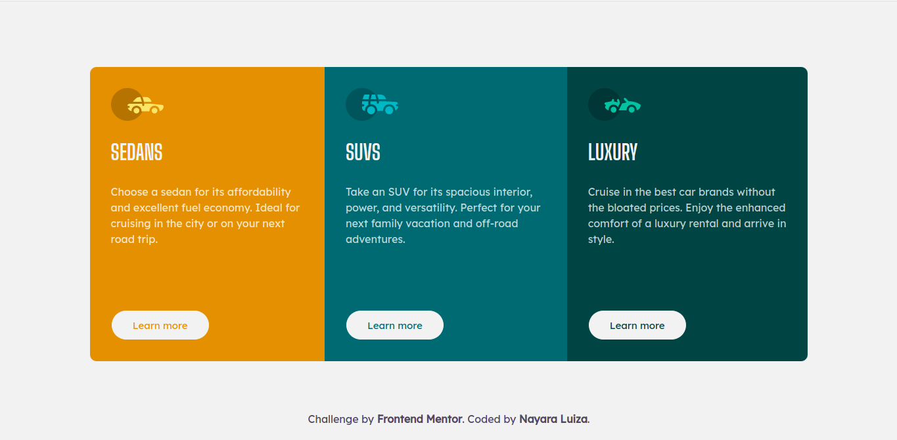
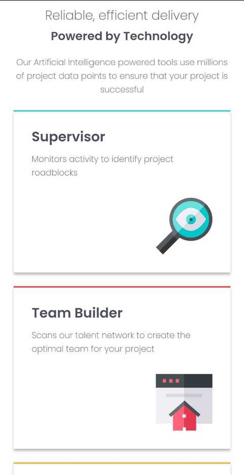
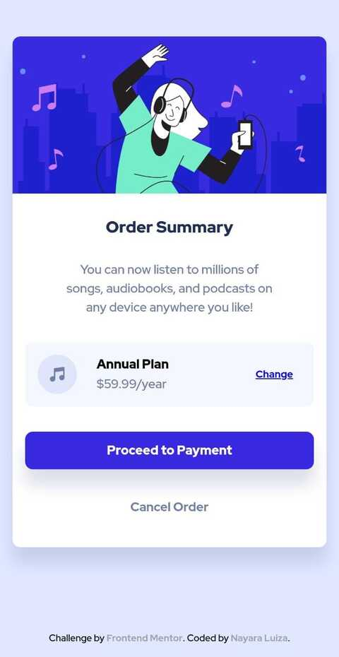
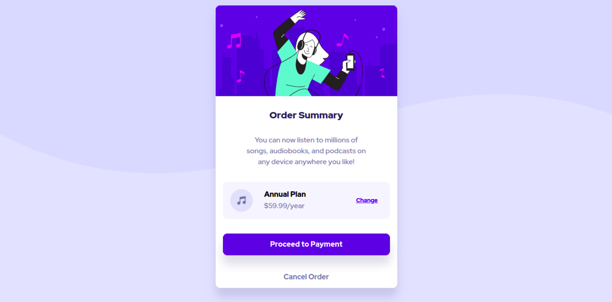
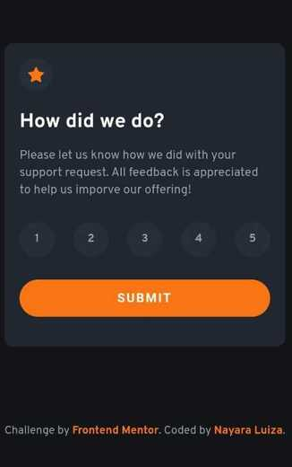
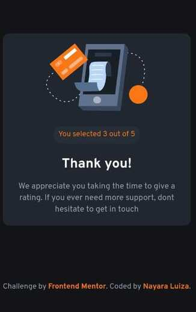

# Frontend Mentor 

[Frontend Mentor](https://www.frontendmentor.io) challenges help you improve your coding skills by building realistic projects.

## Table of contents

- [The chalanges](#the-challanges)

  - [3-column preview card component solution](#3-column-preview-card-component)
    - [Screenshot](#screenshot)
    - [Links](#links)

  - [Four card feature section solution](#four-card-feature-section)
    - [Screenshot](#screenshot-1)
    - [Links](#links-1)

  - [Order summary card solution](#order-summary-card-solution)
    - [Screenshot](#screenshot-2)
    - [Links](#links-2)
    
  - [NFT preview card component solution](#nft-preview-card-component)
    - [Screenshot](#screenshot-3)
    - [Links](#links-3)

  - [Interactive rating component solution](#interactive-rating-component-solution)
    - [Screenshot](#screenshot-4)
    - [Links](#links-4)

  - [FAQ accordion card solution](#faq-accordion-card-solution)
    - [Screenshot](#screenshot-5)
    - [Links](#links-5)

- [My process](#my-process)
  - [Built with](#built-with)
  
- [Author](#author)
  

## The challenges

### 3-column preview card component solution

My first challenge was to build out this [3-column preview card component](https://www.frontendmentor.io/challenges/3column-preview-card-component-pH92eAR2-) and get it looking as close to the design as possible.

The users should be able to:

- View the optimal layout depending on their device's screen size
- See hover states for interactive elements

#### Screenshot

#### Mobile

  

#### Desktop

#### Links

- [Code URL](https://github.com/nalutm/frontend-mentor-challenge/tree/main/3-column-preview-card-component)
- [Live Site URL](https://frontend-mentor-challenge-pi.vercel.app/)

### Four card feature section solution

This is a solution to the [Four card feature section challenge on Frontend Mentor](https://www.frontendmentor.io/challenges/four-card-feature-section-weK1eFYK). 

Users should be able to:

- View the optimal layout for the site depending on their device's screen size

#### Screenshot

#### Mobile

  

#### Desktop

#### Links

- [Code URL](https://github.com/nalutm/frontend-mentor-challenge/tree/main/four-card-feature-section)
- [Live Site URL](https://four-card-feature-section-seven-amber.vercel.app/)

### Order summary card solution

This is a solution to the [Order summary card challenge on Frontend Mentor](https://www.frontendmentor.io/challenges/order-summary-component-QlPmajDUj). 

Users should be able to:

- See hover states for interactive elements

#### Screenshot

#### Mobile

  

#### Desktop

#### Links

- [Code URL](https://github.com/nalutm/frontend-mentor-challenge/tree/main/order-summary-component)
- [Live Site URL](https://frontend-mentor-challenge-tan.vercel.app/)

### NFT preview card component solution

This is a solution to the [NFT preview card component challenge on Frontend Mentor](https://www.frontendmentor.io/challenges/nft-preview-card-component-SbdUL_w0U). 

Users should be able to:

- View the optimal layout depending on their device's screen size
- See hover states for interactive elements

#### Screenshot

#### Mobile

  
  

#### Desktop

#### Links

- [Code URL](https://github.com/nalutm/frontend-mentor-challenge/tree/main/ntf-preview-card-component)
- [Live Site URL](https://whimsical-gumption-997c42.netlify.app/) -->

### Interactive rating component solution

This is a solution to the [Interactive rating component challenge on Frontend Mentor](https://www.frontendmentor.io/challenges/interactive-rating-component-koxpeBUmI).

Users should be able to:

- View the optimal layout for the app depending on their device's screen size
- See hover states for all interactive elements on the page
- Select and submit a number rating
- See the "Thank you" card state after submitting a rating

#### Screenshot

#### Mobile

  
  

#### Desktop

#### Links

- [Code URL](https://github.com/nalutm/frontend-mentor-challenge/tree/main/interactive-rating-component)
- [Live Site URL](https://gilded-cobbler-999935.netlify.app/) 

### FAQ accordion card solution

This is a solution to the [FAQ accordion card challenge on Frontend Mentor](https://www.frontendmentor.io/challenges/faq-accordion-card-XlyjD0Oam).  

Users should be able to:

- View the optimal layout for the component depending on their device's screen size
- See hover states for all interactive elements on the page
- Hide/Show the answer to a question when the question is clicked

#### Screenshot

#### Mobile

  

#### Desktop

#### Links

- [Code URL](https://github.com/nalutm/frontend-mentor-challenge/tree/main/faq-accordion-card)
- [Live Site URL](https://legendary-pegasus-7e3563.netlify.app/)

## My process

### Built with

- Semantic HTML5 markup
- CSS custom properties
- Flexbox
- CSS Grid
- Mobile-first workflow
- JS

## Author

- Frontend Mentor - [@nalutm](https://www.frontendmentor.io/profile/nalutm)
- Linkedin - [Nayara Luiza Moraes](https://www.linkedin.com/in/nayara-luiza-moraes-9a9382b5/)