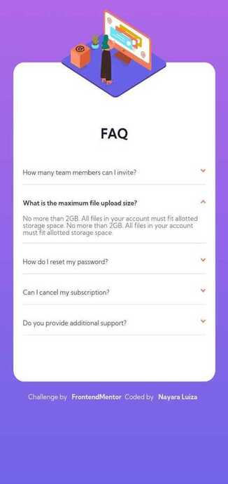
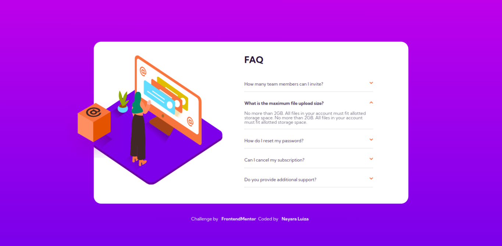

# Frontend Mentor | FAQ accordion card solution

This is a solution to the [FAQ accordion card challenge on Frontend Mentor](https://www.frontendmentor.io/challenges/faq-accordion-card-XlyjD0Oam).  

## Table of contents

- [Overview](#overview)
  - [The challenge](#the-challenge)
  - [Screenshot](#screenshot)
    - [Mobile](#mobile)
    - [Desktop](#desktop)
  - [Links](#links)
- [My process](#my-process)
  - [Built with](#built-with)
- [Author](#author)

## Overview

### The challenge

Users should be able to:

- View the optimal layout for the component depending on their device's screen size
- See hover states for all interactive elements on the page
- Hide/Show the answer to a question when the question is clicked

### Screenshot

#### Mobile

  

#### Desktop

#### Links

- [Code URL](https://github.com/nalutm/frontend-mentor-challenge/tree/main/faq-accordion-card)
- [Live Site URL](https://legendary-pegasus-7e3563.netlify.app/)

## My process

### Built with

- Semantic HTML5 markup
- CSS custom properties
- Flexbox
- CSS Grid
- Mobile-first workflow
- JS 

## Author

- Frontend Mentor - [@nalutm](https://www.frontendmentor.io/profile/nalutm)
- Linkedin - [Nayara Luiza Moraes](https://www.linkedin.com/in/nayara-luiza-moraes-9a9382b5/)

