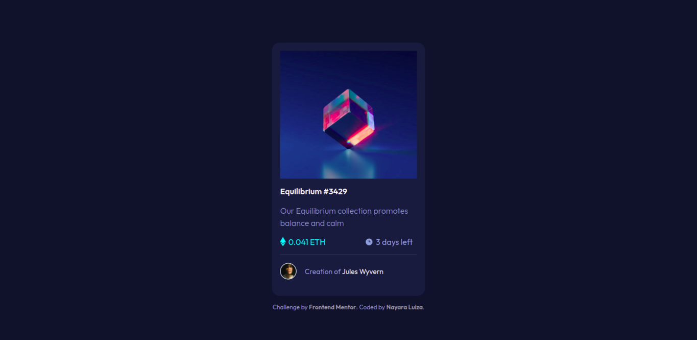

# Frontend Mentor | NFT preview card component solution

This is a solution to the [NFT preview card component challenge on Frontend Mentor](https://www.frontendmentor.io/challenges/nft-preview-card-component-SbdUL_w0U). 

## Table of contents

- [Overview](#overview)
  - [The challenge](#the-challenge)
  - [Screenshot](#screenshot)
    - [Mobile](#mobile)
    - [Desktop](#desktop)
  - [Links](#links)
- [My process](#my-process)
  - [Built with](#built-with)
- [Author](#author)

## Overview

### The challenge

Users should be able to:

- View the optimal layout depending on their device's screen size
- See hover states for interactive elements

### Screenshot

#### Mobile

  
  

#### Desktop

### Links

- [Code URL](https://github.com/nalutm/frontend-mentor-challenge/tree/main/ntf-preview-card-component)
- [Live Site URL](https://whimsical-gumption-997c42.netlify.app/)

## My process

### Built with

- Semantic HTML5 markup
- CSS custom properties
- Flexbox
- CSS Grid
- Mobile-first workflow

## Author

- Frontend Mentor - [@nalutm](https://www.frontendmentor.io/profile/nalutm)
- Linkedin - [Nayara Luiza Moraes](https://www.linkedin.com/in/nayara-luiza-moraes-9a9382b5/)
